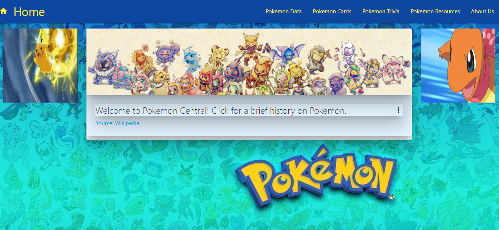
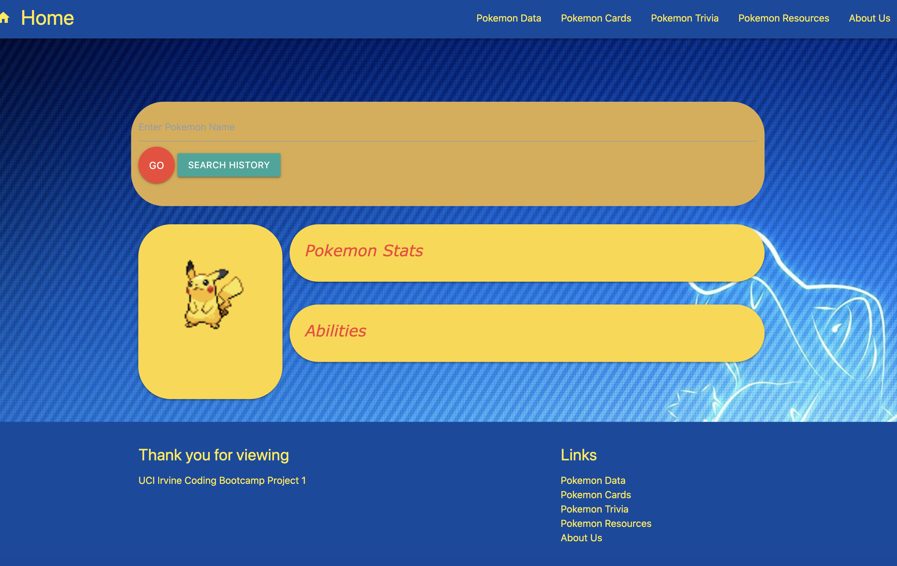
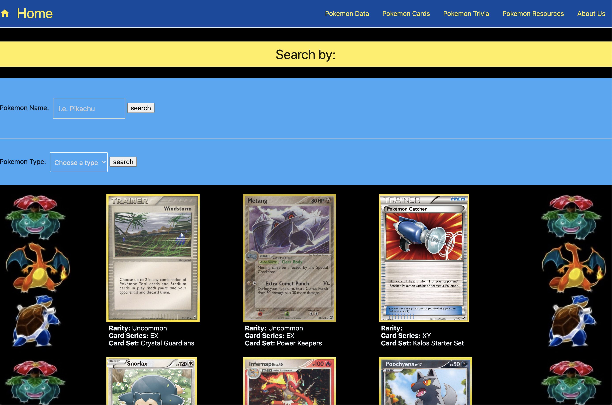
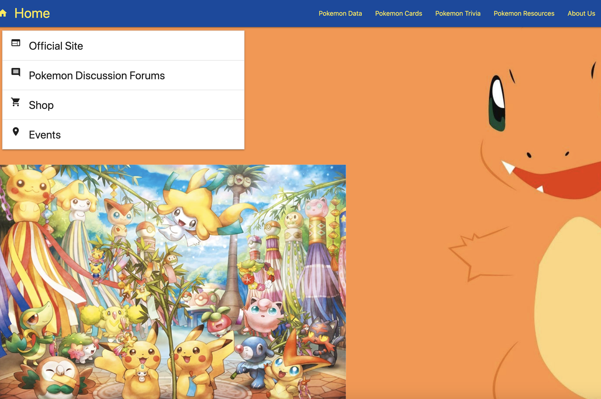

# Poke Project (updated)

## Summary of Updates
This update is still a work in progress. It is an update to the app that was my first group project for my Coding Boot Camp. The primary purpose of this update is to revise some of the glaring issues that existed at the time the app was submitted for our class project.

Most of the issues that need updating are styling related, the most glaring of which were not on the sections of the project I was initially responsible for. Styling updates are made to both larger screen sizes as well as to improve responsiveness of the layout on smaller and mobile screens. However, the home and PokeBlog pages need content work as well.

This updated version of the application is deployed at: https://patdowner.github.io/pokeProject/

## Other App Info
Below is the content of the Read Me from the original iteration of our app.

>### Group Project by:
>* Devin Castro
>* Kalyn Simms
>* Pat Downer
>* Dave Trimboli
>* Jamie Kim
>* Brian Ratunil

The original application is deployed at : https://kalynbsimms.github.io/pokeProject/

### A Pokemon Fan page made by fans for fans.
* Upon arrival to the landing page you are immediately greeted with small introduction and history on Pokemon with a link to the source (wikipedia). Clicking on this card will open an small article exerpt from the source.
* There are 2 animated pokemon, pikachu and charmander in a battle animation loop.
* Pikachu then greets you and presents the contents of the page, along with a tiny questionaire with answers that pop up when you hover over the questions.
* Towards the bottom you you presented with 3 posters that have multiple pokemon in one shot.  Image becomes larger upon click to capture the details.
* Site is mobile responsive for use on smaller screens.
* Navigation bar collapses on smaller screens with a button to bring up links.  Home is always visible.
* Navigation and footer theme colors are blue background with yellow font, to replicate the Pokemon Logo and theme.
* Navigation and footer panel links to; Data, Cards, Trivia, Blog, and About Us pages.

## Technologies Used:
This is a fully functional front-end web-aplication using two main 3rd party API's.  The first one is called, "PokeAPI", in which we have access to all the data for all Pokemon except the newest "Sword" & "Shield" generation.  This data includes the names, ID numbers, stats, photos, moves, types, height, weight, and abilities.  Using vanilla javascript we maniputled our html and navigated the data to provide an interactive application for a user to find all the data on any specific Pokemon that we want.  The second API is called, "Pokemon TCG API".  This API give us data all about Pokemon cards.  We have access to all the Pokemon cards assoiciated with any Pokemon along with more info such as the rarity, the types, the card series, and card set.  Similar to the data API, we create a fully interactive application that allows the user to search for the cards assoiciated with the pokemon of their choice.  For styling we used the Materialize library.  We made full use of many different components to achieve a sleek layout that also is mobile responsive.

## Data Page
The Pokemon Data page is where you can find information on the pokemon of your choosing. Upon arriving on the Pokemon Data page, you will see a search bar near the top of the page.  Simply type in a pokemon name, click the "GO" button, and you will be presented with the following:
* Pokemon Image
* Pokemon Type
* Pokemon Height
* Pokemon Weight
* Pokemon Stats (includes levels for Base Hp, Base Attack, Base Defense, Base Special-Attack, Base Special-Defense, Base Speed.)
* Pokemon Abilities (A detailed paragraph summarizing the pokemon's best qualities and attributes.)
Search for as many Pokemon as you'd like, then click the search history button to see a list of your previously searched Pokemon.
Finally, at the very top of the page, use the navigation bar to check out the rest of our website and traverse through our other pages.

## Trivia Page
Another feature of this application is the "Trivia" page.  We used the PokeAPI here to generate images for random pokemon along with a random answer array full of random Pokemon names.  We then used some CSS to blackout the image to give the retro silhouette vibe.  Anyone who ever watched the Pokemon tv series would recognize this as the "Who's that Pokemon?" minigame.  And this quiz reflects that game.  We keep track of the user score and store the highscore in the local storage.

## PokeBlog page
This page is dedicated to find other resources, information, and Pokemon lore.  There are many different stylings and tons of information about pokemon at this page where a user has access to get more involved and learn more.

## About Us
Lists all group members and our photos.
All members listed with the their function and assigned task.  
These tasks were not locked, we crossed platformed and assisted each other on specific issues that came up.

